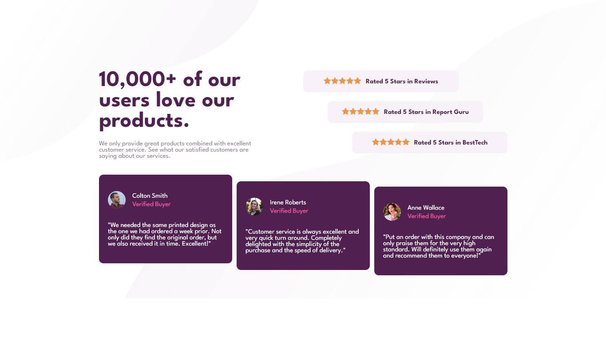

# Frontend Mentor - Social proof section solution

Esta é uma solução para o Desafio [Social proof section challenge on Frontend Mentor](https://www.frontendmentor.io/challenges/social-proof-section-6e0qTv_bA). Os desafios do Frontend Mentor ajudam você a melhorar suas habilidades de codificação criando projetos realistas.

### 🎯 O desafio

Os usuários devem ser capazes de:

- Ver o layout ideal para a seção, dependendo do tamanho da tela do dispositivo

### 🔗 Links 

- [Solução no Frontend Mentor](https://www.frontendmentor.io/solutions/single-price-component-with-grid-and-flex-PMZ7zlHICj)

- [Deployment no Github Pages](https://fransuelton.github.io/social-proof-section/)

### ✨ Tecnologias Utilziadas

- Marcação semântica HTML5
- CSS
- Flexbox
- Grid

### 📚 Aprendizado

Esse desafio foi excelente para aprimorar meu conhecimento sobre o uso de grid e flexbox, explorando diversos tipos de posicionamento de elementos.

### 🚀 Desenvolvimento contínuo

Estou prestes a começar a desenvolver meu portfólio e espero concluí-lo em breve. Continuo me aprofundando no estudo de HTML e CSS, mas tenho planos de incorporar o JavaScript aos meus projetos em breve.

## 🙋 Autor

- Perfil no Linkedin - [Acesse aqui.](https://www.linkedin.com/in/fransuelton/)
- Página no Frontend Mentor - [Acesse aqui.](https://www.frontendmentor.io/profile/Fransuelton)